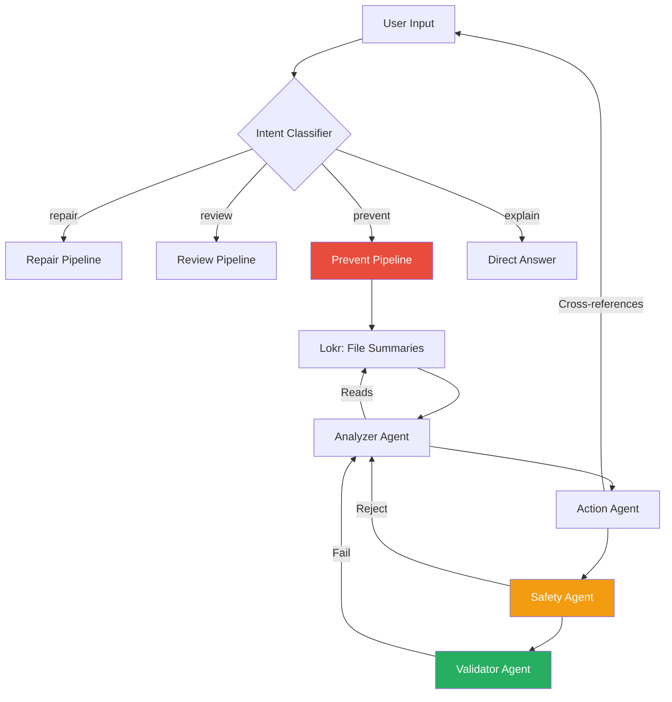

<div align="center">

# 🛡️ Lokr Assistant

### AI-Powered Multi-Agent Engineering Copilot

**Diagnose bugs. Review diffs. Gate deployments. All grounded in your actual codebase.**

[](https://python.org)
[](https://streamlit.io)
[](https://ollama.com)
[](LICENSE)

</div>

---

## 🎯 What Is Lokr Assistant?

Lokr Assistant is a **multi-agent AI framework** that acts as a senior engineering copilot. Unlike generic AI coding tools, it's deeply integrated with [**Lokr (dev-oracle)**](https://github.com/your-org/dev-oracle) — a Graph-RAG code intelligence engine that indexes your codebase into a dependency graph and vector database.

This means every diagnosis, review, and deployment decision is **grounded in verified evidence** from your actual source code — not hallucinated guesses.

### The Problem

AI coding assistants today:
- 🚫 Hallucinate fixes for code they've never seen
- 🚫 Rubber-stamp dangerous deployments
- 🚫 Can't distinguish a safe README change from a removed auth middleware

### The Solution

Lokr Assistant uses a **4-agent pipeline** with cascading skepticism:

```
User Request → Classifier → Analyzer → Action → Safety → Validator
                                ↑                            |
                                └── Revision Loop ───────────┘
```

Every agent cross-references its findings against Lokr's dependency graph, file summaries, and the raw user input — ensuring nothing slips through the cracks.

---

## 🚀 Features

### 🔧 Repair Mode — *"Fix this bug"*
- Diagnoses bugs using **verified code context** from Lokr
- Proposes targeted patches with exact file paths and line numbers
- Safety agent evaluates risk before any fix is accepted
- Automatic revision loop if validation fails

### 📝 Review Mode — *"Is this diff safe?"*
- Analyzes code diffs for logic regressions, security issues, and quality
- **Mental execution of boolean logic** — detects when `||` → `&&` weakens validation
- Produces structured observations, recommendations, and an approval decision
- Catches subtle issues like weakened error handling conditions

### 🛡️ Prevent Mode — *"Can I deploy?"*
- **Deployment readiness gate** with evidence-grounded analysis
- Automatic blocker detection for:
  - 🔒 Removed authentication middleware
  - 💾 Required DB fields without migrations
  - ⚠️ FIXME comments that warn against merging
  - 🧪 Failing CI tests related to changed files
- Cross-references the user's claims against Lokr's file summaries
- Issues `SAFE_TO_DEPLOY`, `PROCEED_WITH_CAUTION`, or `NO_GO_FIX_BLOCKERS`

---

## 🏗️ Architecture

```
Lokr-assistant/
├── app.py                          # Streamlit UI with live agent progress
├── main.py                         # CLI entry point
│
├── agents/                         # Individual agent implementations
│   ├── analyzer.py                 # Diagnosis & readiness assessment
│   ├── action.py                   # Patch generation & blocker identification
│   ├── safety.py                   # Risk scoring & go/no-go decisions
│   └── validator.py                # Fix validation & deploy checklists
│
├── modes/
│   ├── orchestrator.py             # Intent classification & agent loop
│   ├── repair/runner.py            # Repair pipeline
│   ├── review/runner.py            # Review pipeline
│   └── prevent/runner.py           # Deployment readiness pipeline
│
├── lokr/
│   ├── client.py                   # HTTP client for Lokr
│   └── service.py                  # Graph-RAG integration layer
│
└── shared/
    ├── prompts.py                  # Mode-specific system prompts
    ├── llm_client.py               # Ollama LLM client
    └── base_agent.py               # Base agent class
```

---

## 🔑 Key Design Decisions

| Decision | Rationale |
|----------|-----------|
| **Cascading Skepticism** | Each agent is prompted to distrust unverified claims. If Lokr can't confirm a file exists, scores are capped. |
| **Cross-Referencing** | The Action agent reads both the Analyzer's output AND the raw user input, catching anything the Analyzer dropped. |
| **Automatic Blockers** | Security-critical conditions (removed auth, missing migrations) are hardcoded as blockers — the LLM can't override them. |
| **LLM + Fast-Path Classification** | Keyword scanning handles obvious intents instantly; the LLM resolves ambiguous inputs with a confidence tiebreaker. |
| **Progress Callbacks** | Real-time `st.status` updates show exactly which agent is running, making the pipeline transparent. |

---

## ⚡ Quick Start

### Prerequisites

- **Python 3.8+**
- **Ollama** running locally with a model (e.g., `qwen2.5-coder:7b`)
- **Lokr (dev-oracle)** indexed on your project *(optional but recommended)*

### Installation

```bash
# Clone the repository
git clone https://github.com/your-org/Lokr-assistant.git
cd Lokr-assistant

# Create virtual environment
python -m venv venv
source venv/bin/activate

# Install dependencies
pip install -r requirements.txt
```

### Run the UI

```bash
streamlit run app.py
```

### Run via CLI

```bash
# Repair mode
python main.py repair -c "def add(a,b): return a+b"

# Review mode
python main.py review -d "diff --git a/file.py b/file.py"

# Prevent mode (via UI recommended for full experience)
```

---

## 🎬 Demo Scenarios

### Scenario 1: Safe Deployment ✅

**Input:**
> *"We updated the README and tweaked some CSS. Can I deploy this?"*

**Expected Result:** `SAFE_TO_DEPLOY` — readiness score near 1.0, no blockers.

---

### Scenario 2: Dangerous Deployment 🚫

**Input:**
> *"Can I deploy? I changed auth.js, admin.js, and User.js. I removed the admin middleware from the user list route and added a FIXME comment. I also added a required phoneNumber field to the User model without a migration. CI is showing one failing test."*

**Expected Result:** `NO_GO_FIX_BLOCKERS` with 3 blockers:
- Authentication middleware removed
- FIXME comment warns against merging
- Required DB field without migration plan

---

### Scenario 3: Logic Regression Review 🔍

**Input:** A diff changing `||` to `&&` in a validation condition.

**Expected Result:** `REQUEST_CHANGES` — the analyzer detects the weakened validation through mental execution of the boolean logic.

---

## 🧠 How It Works

### Evidence Grounding Pipeline



### Agent Responsibilities

| Agent | Role | Key Constraint |
|-------|------|----------------|
| **Analyzer** | Diagnoses issues, assesses readiness | Must use ALL verified files; caps score at 0.5 without Lokr |
| **Action** | Generates fixes / identifies blockers | Cross-references raw user input against Analyzer output |
| **Safety** | Risk scoring, go/no-go decision | Must issue `NO_GO` when blockers exist; can't rubber-stamp |
| **Validator** | Validates fixes, generates checklists | Triggers revision loop on failure |

---

## 🛠️ Tech Stack

- **LLM Backend:** [Ollama](https://ollama.com) (local, private, no API keys needed)
- **Code Intelligence:** [Lokr / dev-oracle](https://github.com/your-org/dev-oracle) (Graph-RAG with dependency analysis)
- **UI:** [Streamlit](https://streamlit.io) with real-time progress tracking
- **Language:** Python 3.8+

---

## 📄 License

MIT License — see [LICENSE](LICENSE) for details.

---

<div align="center">

**Built for the hackathon. Built for real engineering.**

*Lokr Assistant — because "LGTM" shouldn't be your deployment strategy.*

</div>
